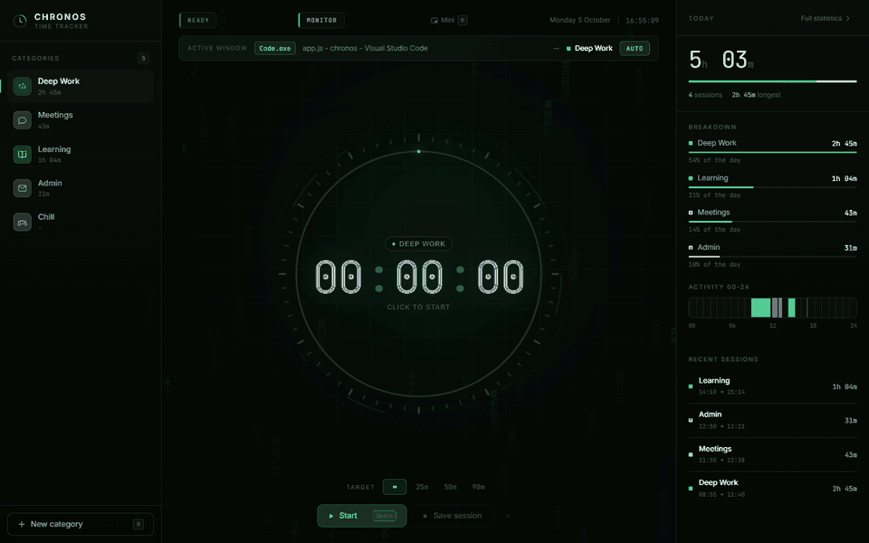
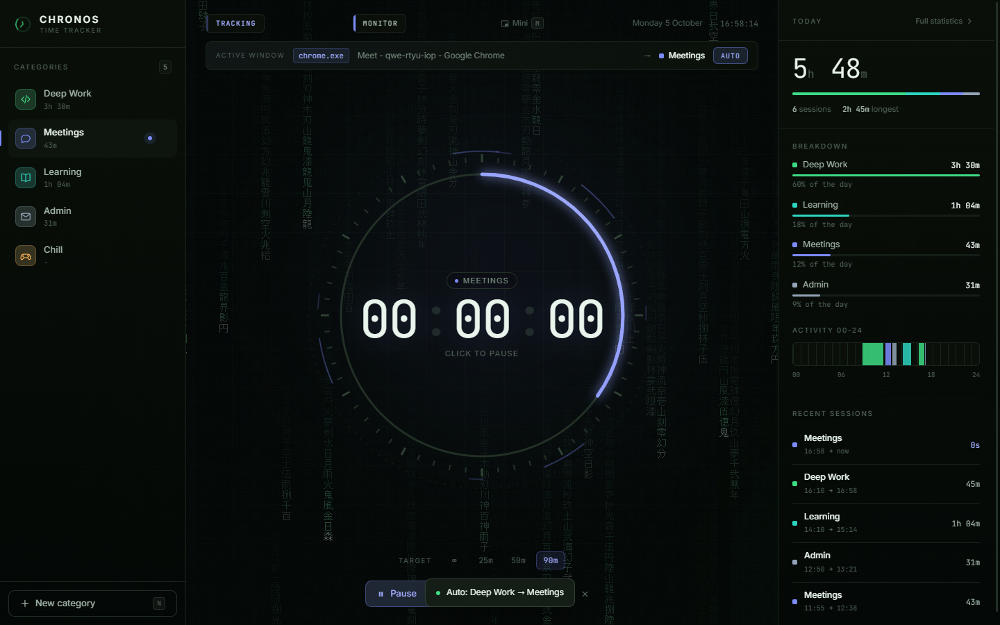
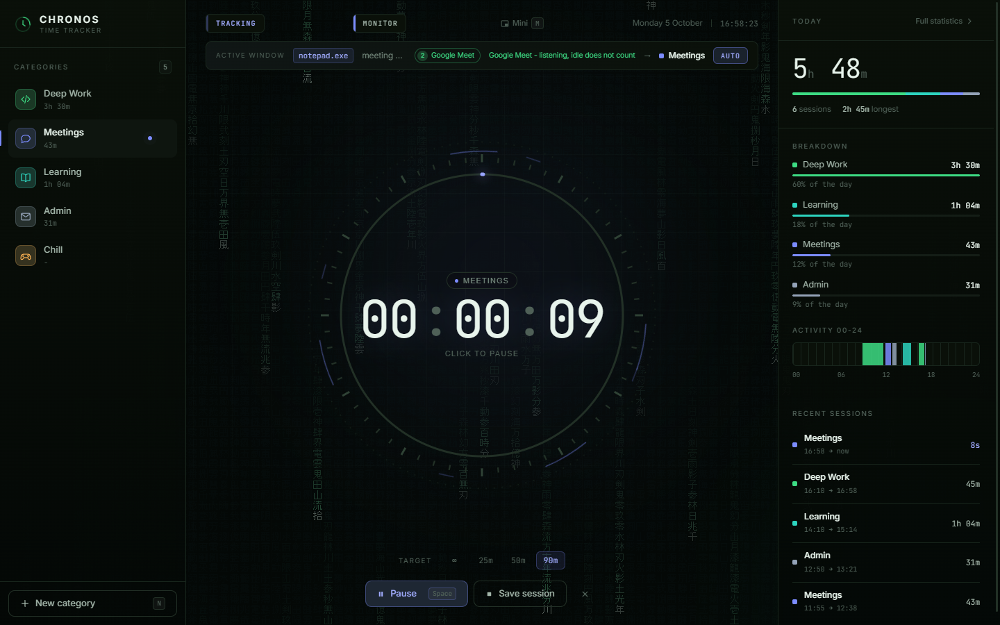
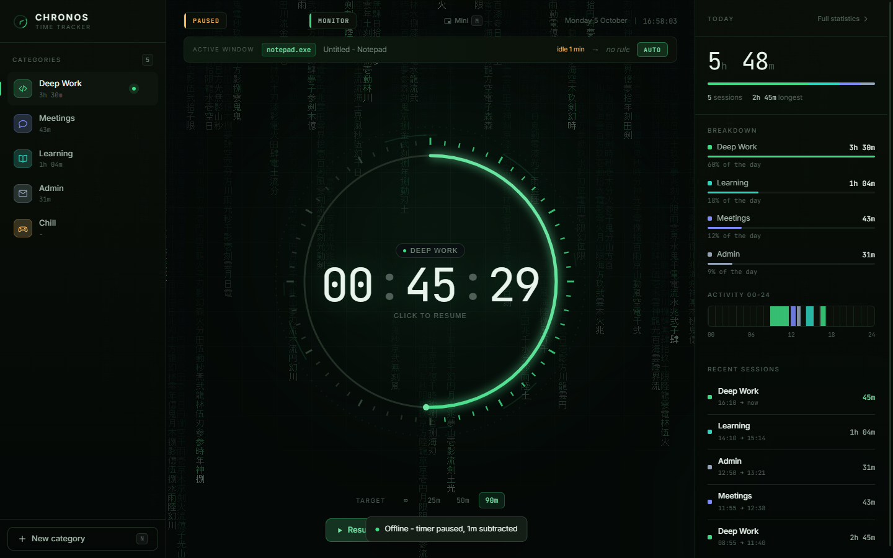
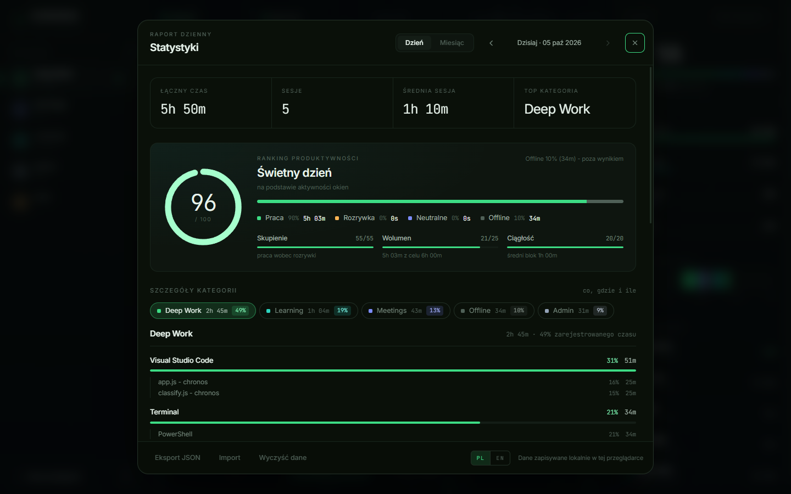
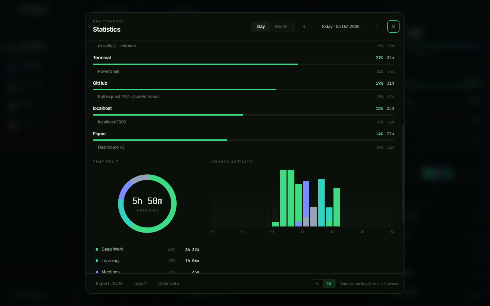

[English](README.md) · **Polski**

# CHRONOS

[](https://github.com/kvdzidev/chronos/actions/workflows/ci.yml)
[](LICENSE)

Tracker czasu, który działa na Twoim komputerze. Wybierasz kategorię, klikasz
tarczę i pracujesz. Na Windows potrafi też sprawdzać, w jakim oknie jesteś,
sam rozdzielać czas na pracę i rozrywkę, a na koniec dnia wystawić ocenę w skali
do 100.

Bez konta, bez chmury, bez instalowania czegokolwiek z npm czy pip. To zwykły
HTML/CSS/JS i jeden skrypt w Pythonie, który korzysta tylko z biblioteki
standardowej.



## Co potrafi

-  Timer z celem sesji (25 / 50 / 90 min), pauzą, zapisem i odrzuceniem.
-  Kategorie z kolorem i ikoną, monogramem albo własnym obrazkiem.
-  Czyta aktywne okno na każdym monitorze (Windows) i zna ponad 100 aplikacji i serwisów.
-  Odróżnia tutorial Reacta na YouTube od speedruna Minecrafta.
-  Po 40 s bezczynności wycina ten czas, ale nie w trakcie rozmowy na Meet czy Zoomie.
-  Ocenia dzień za skupienie, ilość pracy i ciągłość i pokazuje, skąd wynik.
-  Raport dnia aż do pojedynczych plików i kart przeglądarki, do tego kalendarz miesiąca.
-  Mała nakładka zawsze na wierzchu, gdy główne okno jest zminimalizowane.
-  Polski i angielski.
-  Dane zostają w lokalnym profilu przeglądarki. Agent słucha tylko na `127.0.0.1`.

## W użyciu

**Kategoria idzie za oknem.** Przy włączonym AUTO wejście na Meet przenosi
trwający pomiar z *Deep Work* do *Meetings* (decyduje reguła `meet` w tej
kategorii). Okno musi zostać na wierzchu 5 sekund, więc szybki Alt+Tab niczego
nie przełącza.



**Spotkanie to nie bezczynność.** Rozmowa leci na drugim monitorze, robisz
notatki, a mysz stoi od 6 minut. Pasek pokazuje, dlaczego pomiar trwa.



**Odejście od komputera już tak.** Bez rozmowy po 40 sekundach bez ruchu timer
się wstrzymuje, a bezczynność jest odejmowana. Po powrocie liczy dalej sam.



| Raport dnia | Na co poszedł czas |
|---|---|
|  |  |

| Miesiąc | Edycja kategorii |
|---|---|
|  |  |

| Mini-nakładka | Pierwsze uruchomienie |
|---|---|
|  |  |

Na zrzutach są wymyślone dane demo.

## Jak zacząć

Potrzebujesz [Pythona 3.8+](https://www.python.org/downloads/) i Chrome'a, Edge'a,
Brave'a, Opery albo Vivaldi. Śledzenie okien działa na Windows, na macOS i Linuksie
aplikacja działa w trybie ręcznym.

```bash
git clone https://github.com/kvdzidev/chronos.git
cd chronos
python chronos.py
```

Na Windows możesz zamiast tego kliknąć dwa razy `CHRONOS.vbs` (bez okna konsoli).
Jednorazowe uruchomienie `create-shortcut.cmd` doda ikonę na pulpit.

Aplikacja otwiera się we własnym oknie i przy pierwszym starcie pyta o język.
Zamknięcie okna kończy wszystko.

 Instrukcja krok po kroku: [docs/INSTRUKCJA.md](docs/INSTRUKCJA.md) (in English: [docs/USER_GUIDE.md](docs/USER_GUIDE.md))

## Klawiatura

| Klawisz | Akcja |
|---|---|
| `Spacja` | start / pauza |
| `Enter` | zapisz sesję |
| `1`-`9` | wybór kategorii |
| `N` | nowa kategoria |
| `S` | statystyki |
| `D` / `W` | raport dnia / miesiąca |
| `←` `→` | poprzedni / następny dzień lub miesiąc |
| `M` | mini-nakładka |
| `Esc` | zamknij okno dialogowe |

## Prywatność

Nie ma serwera ani telemetrii, nawet fonty są w repo. Historia leży w
`localStorage` osobnego profilu przeglądarki w `.chronos-profile/`, który jest
w `.gitignore`. Agent zwraca tytuł okna na wierzchu, nazwę procesu i czas
bezczynności. Nie zapisuje klawiszy, nie robi zrzutów ekranu i nie czyta treści
stron. Kopię zapasową robisz przyciskiem *Eksport JSON* w statystykach.

## Jak to działa

`chronos.py` uruchamia lokalny serwer na porcie 8899, wystawia agenta okien
(`agent.py`, Win32 API przez `ctypes`) pod `/agent/now` i otwiera aplikację
w trybie okna aplikacji przeglądarki. Front pyta agenta co 1,5 s, `classify.js`
rozpoznaje okno, a `app.js` prowadzi dziennik i liczy wynik.

Szczegóły klasyfikatora, rankingu, obsługi offline i formatu danych:
[docs/HOW_IT_WORKS.md](docs/HOW_IT_WORKS.md) (po angielsku).

## Rozwój

Nie ma budowania. Zmieniasz plik i odświeżasz okno `Ctrl+R`.

```bash
python chronos.py --no-window   # sam serwer, otwórz http://127.0.0.1:8899
node --test                     # testy, Node 18+
```

Dodanie serwisu albo aplikacji do klasyfikatora to zwykle jedna linijka, zobacz
[CONTRIBUTING.md](CONTRIBUTING.md).

## Licencja

[MIT](LICENSE). Dołączone fonty Inter i JetBrains Mono są na licencji SIL Open Font License.
