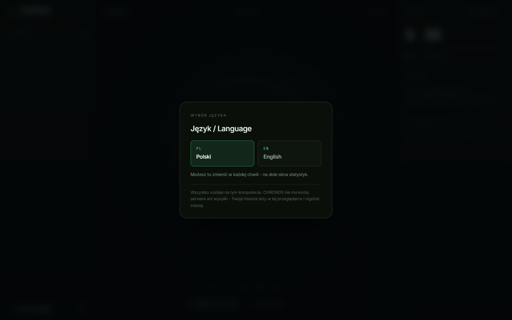
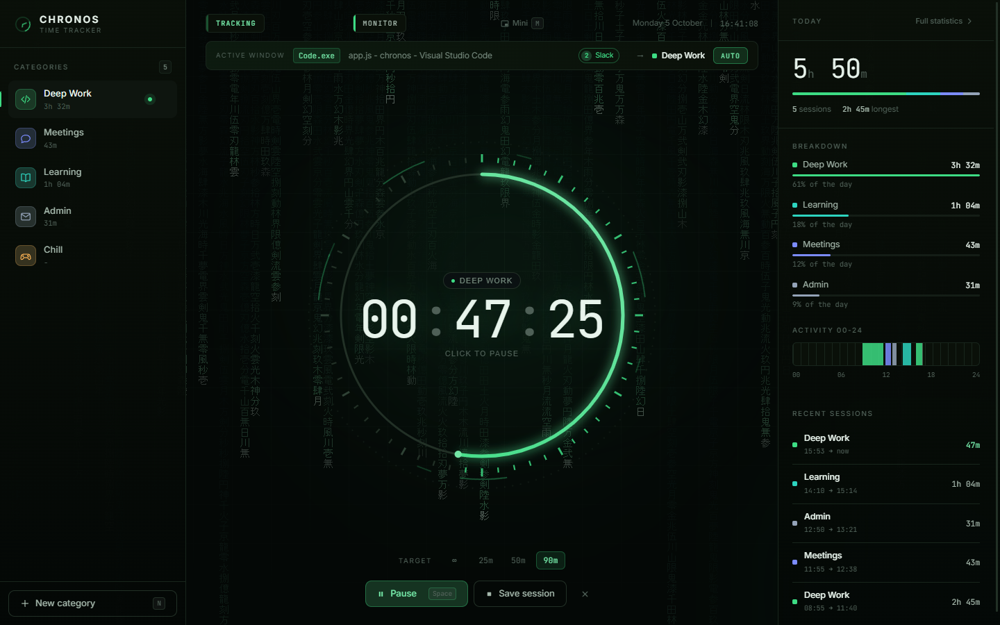
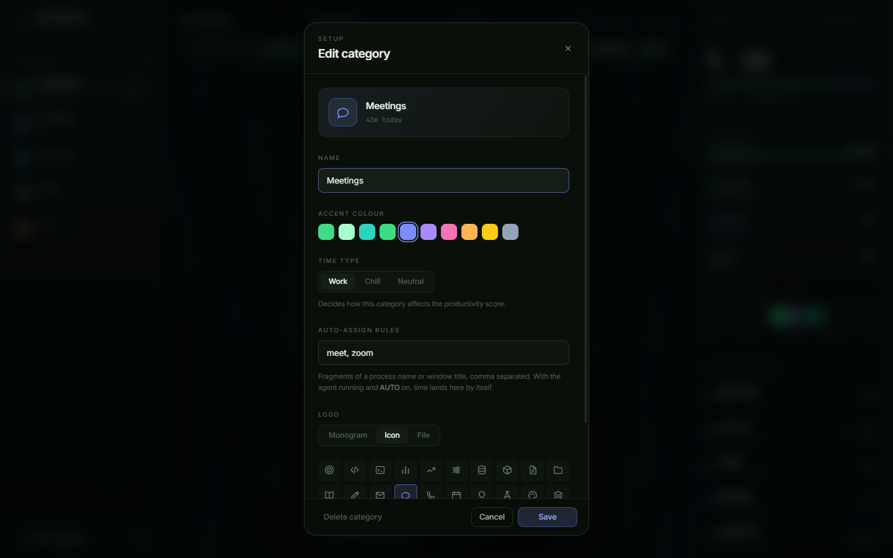
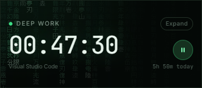
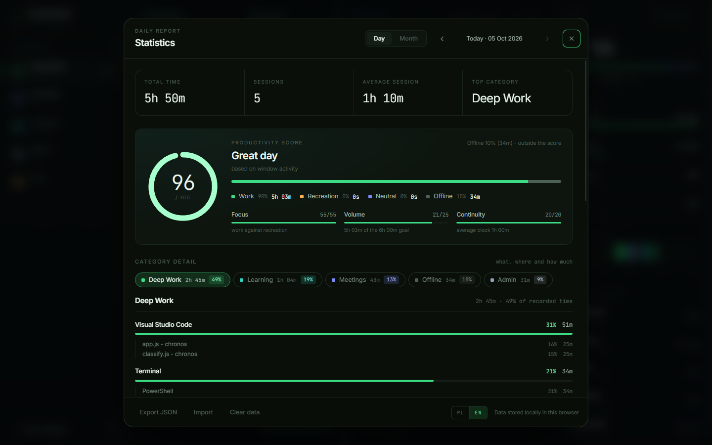
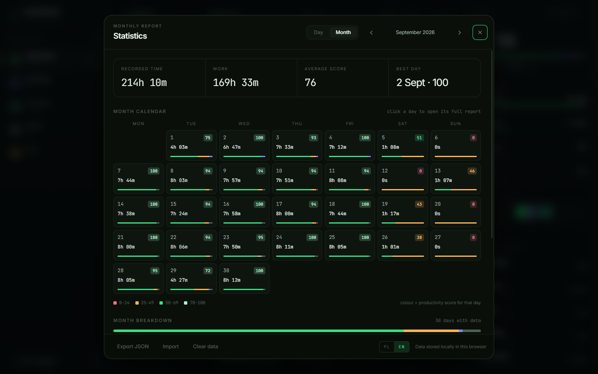

# CHRONOS - user guide

[Wersja polska](INSTRUKCJA.md) · [← README](../README.md)

This guide takes you from zero to daily use: installation, first launch, timing,
automatic window tracking, reports and backups. Troubleshooting is at the end.

## Contents

1. [Requirements](#1-requirements)
2. [Installation](#2-installation)
3. [First launch](#3-first-launch)
4. [The interface at a glance](#4-the-interface-at-a-glance)
5. [Tracking time](#5-tracking-time)
6. [Categories](#6-categories)
7. [Automatic window tracking (the agent)](#7-automatic-window-tracking-the-agent)
8. [Mini overlay](#8-mini-overlay)
9. [Statistics and the score](#9-statistics-and-the-score)
10. [Backups, import, clearing data](#10-backups-import-clearing-data)
11. [Changing the language](#11-changing-the-language)
12. [Keyboard shortcuts](#12-keyboard-shortcuts)
13. [Troubleshooting](#13-troubleshooting)
14. [Updating and uninstalling](#14-updating-and-uninstalling)

---

## 1. Requirements

| What | Version | Notes |
|---|---|---|
| OS | Windows 10/11 | macOS and Linux run in manual mode (no window agent) |
| Python | 3.8 or newer | standard library only, nothing else to install |
| Browser | Chrome, Edge, Brave, Opera or Vivaldi | used for the app window and the mini overlay |

Check that Python is available - open **Command Prompt** (`Win+R` → `cmd`) and run:

```
python --version
```

If you see `Python 3.x.x` you are set. Otherwise:

1. Download the installer from <https://www.python.org/downloads/>.
2. On the first screen **tick "Add python.exe to PATH"**.
3. Click *Install Now*, then open a new `cmd` window and check again.

## 2. Installation

**Option A - with Git:**

```
git clone https://github.com/kvdzidev/chronos.git
```

**Option B - without Git:** on the repository page click **Code → Download ZIP**
and extract it somewhere permanent, e.g. `C:\Apps\chronos`.

> Pick a permanent location. Your history is stored in the `.chronos-profile`
> subfolder next to the app - moving the folder moves your data with it.

**Desktop shortcut (Windows, optional):** double-click **`create-shortcut.cmd`**
in the app folder. A **CHRONOS** icon appears on your desktop.

## 3. First launch

**Windows:** double-click the **CHRONOS** desktop shortcut or **`CHRONOS.vbs`**
in the app folder.

**macOS / Linux:** in a terminal, inside the app folder:

```
python3 chronos.py
```

What happens:

1. A local server starts on `http://127.0.0.1:8899` (reachable from your computer only).
2. A maximised app window opens - no tabs, no address bar.
3. CHRONOS asks for the language. Pick **Polski** or **English**.



You start with two categories: **Work** and **Chill**. There is no sample data -
everything you see in the statistics has actually been measured.

**Closing the app window stops the whole program** - nothing keeps running.

## 4. The interface at a glance



| Area | Contents |
|---|---|
| **Left column** | categories with today's time, *New category* button |
| **Top bar** | status (Ready / Tracking / Paused), agent status, *Mini* button, date and clock |
| **"Active window" strip** | shown while the agent runs: process, window title, second monitor, matched category, **AUTO** switch |
| **Dial** | current session time; click = start / pause |
| **Bottom** | session target (∞ / 25 / 50 / 90 min), *Start/Pause*, *Save session*, **×** discard |
| **Right column** | today at a glance: total, sessions, split by category, 00-24 strip, recent sessions |

## 5. Tracking time

### The basic loop

1. **Pick a category** in the left column (or press `1`-`9`).
2. **Click the dial** or press `Space` - the status changes to *Tracking*.
3. **Pause:** click the dial / `Space` again. Paused time is not counted.
4. **Finish:** *Save session* or `Enter`. The session goes into your history.
5. **Discard:** the **×** button - the session is dropped without saving.

Sessions shorter than one second are not saved.

### Session target

**∞ / 25m / 50m / 90m** set a target. The arc on the dial shows progress; when
the target is reached you get a notice and the dial flashes. Tracking carries on -
the target never stops anything. On **∞** the arc completes once a minute.

### Switching category while tracking

Clicking another category **saves the current session and immediately starts a
new one** in the chosen category.

### Closing the app mid-session

You do not need to click anything first - state is saved every few seconds and
once more when the window closes. The clock **does not run while the app is
off**: time is counted up to the last save only.

| Gap | On reopening |
|---|---|
| under 5 min (restart, refresh) | the session resumes by itself |
| longer | the session waits **paused** - one click on the dial resumes it |

## 6. Categories

### Adding and editing

- **New:** *New category* at the bottom of the left column, or press `N`.
- **Edit:** hover a category and click the pencil icon.



| Field | Meaning |
|---|---|
| **Name** | up to 28 characters |
| **Accent colour** | the whole app takes it on while the category is active (dial, arc, buttons) |
| **Time type** | `Work`, `Chill` or `Neutral` - decides how the category affects the score |
| **Auto-assign rules** | fragments of a process name or window title, comma separated, e.g. `code.exe, github, figma` |
| **Logo** | *Monogram* (first two letters), *Icon* (40 line icons) or *File* (PNG/JPG/SVG up to 6 MB, cropped to a 128 px square) |

### Deleting

In the editor click *Delete category* and confirm. Its saved sessions stay in the
statistics as "Deleted category".

## 7. Automatic window tracking (the agent)

> Windows only. Without the agent everything else works - just manually.

### Turning it on

When you start with `CHRONOS.vbs` or `python chronos.py` **the agent runs
automatically**. A green **Monitor** status appears in the top bar, with the
**Active window** strip below it.

(Advanced: `agent.cmd` runs the agent on its own on port 8900 if you prefer to
keep it separate - the app finds it by itself.)

### What the agent sees and what it does not

| Sees | Does not see |
|---|---|
| the title of the front window (on every monitor) | keystrokes |
| the process name, e.g. `Code.exe` | screen or page content |
| seconds since the last mouse/keyboard input | URLs or browser history |

The agent listens on `127.0.0.1` only, writes nothing to disk and never connects
to the internet.

### The activity log (whenever the agent runs)

Even with AUTO off, CHRONOS records what you spend time in (app, site, tab) and
uses it for the score and for *Category detail* in the statistics. A stretch of
activity is assigned to a category in this order:

1. **Your rule** from *Auto-assign rules* - always wins.
2. **The classifier's verdict** (work / recreation) → the first category of that type.
3. **The running session**, when the classifier is neutral (e.g. File Explorer mid-work).
4. Otherwise → **Unassigned**.

### The AUTO switch

Off by default. When on, the **running measurement** moves to the category that
matches the active window once that window has stayed in front for **5 seconds**
(a quick Alt+Tab does not split anything). AUTO never starts a measurement on its
own - starting is always your call.

### Being away (offline)

- After **40 s** without mouse or keyboard input CHRONOS goes *offline*: tracking
  pauses and the idle stretch is **subtracted** from the session.
- When you come back, tracking resumes by itself.
- **Meetings:** when Google Meet, Zoom, Teams, Slack, Webex, Whereby or Jitsi is
  visible on **any** monitor, the threshold rises to **45 minutes** - in a call you
  mostly listen and leave the mouse alone.
- A locked screen (`Win+L`) always counts as away.

### What counts as work and what as recreation

Signals add up; no single rule decides:

| Window title | Verdict |
|---|---|
| `React useEffect explained - YouTube` | work |
| `Minecraft speedrun 1.16 WR - YouTube` | recreation |
| `ThePrimeagen - Docker in 10 minutes - Twitch` | work |
| `(3) Messenger`, Discord, Facebook | work (a contact channel) |
| reels, shorts, TikTok | neutral up to **3 min a day**, then all of it is recreation |
| `New tab` | neutral |

If something is classified differently than you would like, the easiest fix is a
**rule on a category** (e.g. `facebook` on a *Chill* category). Changing the
classifier itself is covered in [CONTRIBUTING.md](../CONTRIBUTING.md).

## 8. Mini overlay

The **Mini** button (or `M`) opens a small window that stays **on top of everything**:



- shows the category, the time, a start/pause button, today's total and the active window,
- can be dragged anywhere and resized freely,
- `Space` works here too; **Expand** closes it and returns to the main window,
- you can minimise the main window meanwhile - tracking and the agent keep full precision.

It needs a Chromium browser. If there is no *Mini* button, the app was opened
straight from `index.html` instead of through `CHRONOS.vbs`.

## 9. Statistics and the score

Open with **Full statistics** (top right) or press `S`.

### Day view (`D`)



- **KPIs:** total time, sessions, average session, top category.
- **Productivity score 0-100** with the work / recreation / neutral / offline split.
- **Category detail** - click a tab to see apps, sites, files and tabs with time and share.
- **Time split** ring, **hourly activity**, **session log**.
- Delete a session with **×** in the log - you can **undo** it for 6 seconds.
- `←` `→` move between days.

### Month view (`W`)



A calendar where each day shows its colour-coded score, work time and a proportion
bar. **Click a day to open its full report.** `←` `→` move between months.

### How the score is calculated

| Part | Range | Measures |
|---|---|---|
| **Focus** | 0-55 | `work / (work + recreation)` |
| **Volume** | 0-25 | work against a 6-hour daily goal |
| **Continuity** | 0-20 | average work block length (full marks from 30 min) |

Neutral and offline time never lower the score. Thresholds: `85+` great day ·
`70+` very good · `50+` solid · `25+` scattered · below that - an easy day.

Without the agent the score is computed from manual sessions and category types.

## 10. Backups, import, clearing data

Buttons at the bottom of the statistics window:

| Button | What it does |
|---|---|
| **Export JSON** | downloads `chronos-YYYY-MM-DD.json` with categories, sessions and the activity log |
| **Import** | loads such a file and **replaces** the current data (after confirmation) |
| **Clear data** | deletes everything and goes back to the two starting categories (after confirmation) |

Good habits:

- Export regularly, e.g. weekly, and keep the file outside the app folder.
- **Before clearing browser data** or deleting `.chronos-profile`, always export -
  that is where your whole history lives.
- The activity log (windows, tabs) is trimmed to 30 days; saved sessions are kept
  indefinitely.

## 11. Changing the language

In the statistics window, bottom right, click **PL** or **EN**. It applies
instantly and never touches your data.

## 12. Keyboard shortcuts

| Key | Action |
|---|---|
| `Space` | start / pause |
| `Enter` | save session |
| `1`-`9` | pick category |
| `N` | new category |
| `S` | statistics (open / close) |
| `D` / `W` | daily / monthly report |
| `←` `→` | previous / next day or month |
| `M` | mini overlay |
| `Esc` | close dialog |

Shortcuts are ignored while typing in a text field.

## 13. Troubleshooting

**Nothing happens after double-clicking `CHRONOS.vbs`, or it says Python was not found.**
Python is not on `PATH`. Reinstall it with *Add python.exe to PATH* ticked
(see [Requirements](#1-requirements)).

**I want to see what went wrong.**
Run **`start.cmd`** - the same as `CHRONOS.vbs` but with a visible console.
The startup log is also written to `chronos.log` in the app folder.

**A regular browser tab opens instead of a separate window.**
No Chromium browser was found (Chrome, Edge, Brave, Opera, Vivaldi). Install one -
CHRONOS picks it up on the next start.

**"Port 8899 busy".**
CHRONOS is already running - instead of a second copy, a window of the running one
opens. If you cannot see it, end `pythonw.exe` in Task Manager and start again.

**No "Active window" strip / "Monitor offline".**
The agent works on Windows only. Make sure the app was started through
`CHRONOS.vbs` / `chronos.py`, not by opening `index.html` from disk.

**No *Mini* button.**
The mini overlay needs a Chromium browser and a start through the server
(`CHRONOS.vbs`, `start.cmd` or `python chronos.py`).

**"Another CHRONOS tab holds newer data".**
The app is open in two windows. Close one - the one showing the notice will not
overwrite the other's newer data.

**"Could not read the save".**
The saved data was corrupt. The original was set aside in `localStorage` under the
key `chronos.v1.uszkodzone` and the app started empty. If you have a JSON export,
import it.

**The score says "based on manual sessions".**
The agent collected no window data that day (it was not running, or you are on
macOS/Linux). The score then comes from category types.

**Running without a window (e.g. on a server or for testing).**
`python chronos.py --no-window`, then open `http://127.0.0.1:8899` in a browser.

## 14. Updating and uninstalling

**Updating:** close the app, then `git pull` in the app folder (or download a new
ZIP and copy the files **over** the old ones, **keeping** the `.chronos-profile`
folder). Data migrates by itself on the first start.

**Uninstalling:** export JSON if you want to keep your history, then delete the app
folder and the desktop shortcut. CHRONOS leaves nothing in the registry or anywhere
else on the system.
